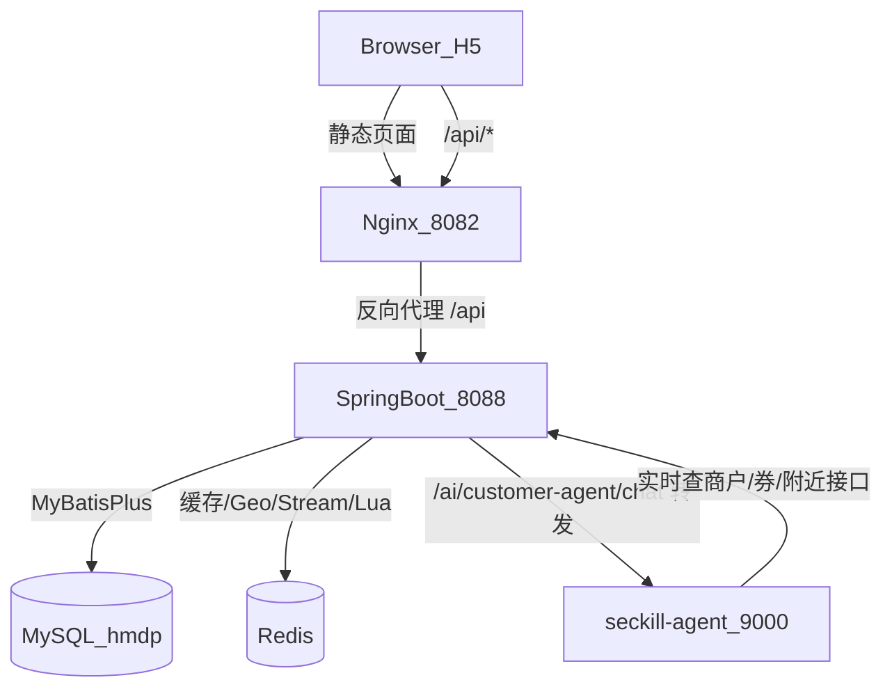

# hm-dianping 面试速记（实现细节 & 知识点）

> 目标：面试前快速回忆“做了什么、为什么这么做、关键实现在哪里、能扛住哪些追问”。  
> 适用：讲项目整体 + 深挖缓存/秒杀/Redis/并发/Agent 接入/地图 GEO。  

---

## 1. 总体架构与运行形态

### 1.1 组件
- **前端**：静态页面 + Vue（`nginx-1.18.0/html/hmdp/`），经 **Nginx** 提供访问
- **网关/静态服务**：Nginx（默认 `8082`），`/api` 反代到后端
- **后端**：Spring Boot（默认 `8088`），单体应用
- **数据层**：MySQL + Redis
- **秒杀链路**：Redis Lua + Redis Stream + 应用内消费者线程
- **智能体**：独立 FastAPI 服务 `seckill-agent`（默认 `9000`），后端转发调用

### 1.2 请求路径（高频问法）

---

## 2. 技术栈（背诵版）

### 2.1 后端（Java）
- Spring Boot / Spring MVC
- MyBatis-Plus（分页/CRUD）
- MySQL（业务数据）
- Redis
  - **缓存**（穿透/击穿/雪崩相关策略）
  - **GEO**（附近商户距离排序）
  - **Lua**（秒杀原子校验/扣库存/写消息）
  - **Stream**（削峰异步下单）
- Redisson（分布式锁/高级 Redis 客户端）
- 全局异常处理（统一 `Result`）

### 2.2 前端（静态）
- Vue + axios + Element UI
- Nginx 作为静态资源与 `/api` 反代

### 2.3 智能体（Python）
- FastAPI + Uvicorn
- httpx（调后端/可选调 LLM）
- python-dotenv（`.env` 配置）
- 可选：OpenAI 兼容 LLM（OpenRouter / OneAPI / DeepSeek / 通义等）

---

## 3. 目录结构与分层（后端）

### 3.1 Java 分层
- `controller`：路由层（参数接收、调用 service、返回 `Result`）
- `service` / `service/impl`：核心业务逻辑（缓存策略、秒杀流程、事务、锁）
- `mapper`：数据访问层（BaseMapper + XML 自定义 SQL）
- `entity`：表映射实体
- `dto`：入参/出参对象
- `utils`：通用组件（缓存工具、锁、拦截器、常量、正则、ID 等）
- `config`：拦截器、MyBatis、Redisson、异常处理等

### 3.2 关键配置文件
- `src/main/resources/application.yaml`：端口/数据源/Redis/agent 转发配置
- `src/main/resources/mapper/*.xml`：自定义 SQL（如优惠券与秒杀券 join）
- `src/main/resources/seckill.lua`：秒杀原子脚本

---

## 4. 通用返回体与异常处理

### 4.1 统一返回 `Result`
- `success / errorMsg / data / total`
- 面试点：统一前后端协议，前端拦截器可统一处理 success=false

### 4.2 全局异常
- `WebExceptionAdvice`：将参数错误/运行时异常统一包装为 `Result.fail(...)`
- 面试点：避免 controller scattered try/catch；日志集中打点

---

## 5. 登录鉴权与 Token 刷新

### 5.1 登录流程（验证码）
- `UserServiceImpl.login`：校验验证码 → 查询/创建用户 → 生成 token → `login:token:{token}` 写入 Redis Hash → 设置 TTL

### 5.2 拦截器链
- `RefreshTokenInterceptor`：每次请求读取 header `authorization`，从 Redis 取 userMap，放入 `UserHolder`，刷新 TTL
- `LoginInterceptor`：对非白名单路径检查 `UserHolder.getUser()`，未登录拦截
- `MvcConfig`：拦截器 order：先刷新 token，再登录校验

### 5.3 logout
- `POST /user/logout`：删除 `login:token:{token}`，清理 `UserHolder`
- 面试点：前端清理 `sessionStorage.token`，后端删除 Redis token，实现“服务端失效”

---

## 6. 店铺模块：缓存与 GEO

### 6.1 店铺详情缓存（CacheClient）
常见 3 套方案：
- **缓存穿透**：空值缓存（短 TTL）
- **缓存击穿**：互斥锁重建（热点 key）
- **逻辑过期**：缓存值 + expireTime；过期后“先返回旧值，后台异步重建”

代码位置（关键入口）：
- `ShopServiceImpl.queryById` → `CacheClient.queryWithLogicalExpire(...)`（当前实现）

面试点：
- 为什么逻辑过期：高并发下不阻塞请求、可用性更好
- 代价：短时间返回旧数据，需业务允许；重建线程池要限流

### 6.2 GEO 附近查询（原生项目能力）
`ShopServiceImpl.queryShopByType(typeId, current, x, y)`：
- 无坐标：DB 分页
- 有坐标：Redis GEOSEARCH
  - key：`shop:geo:{typeId}`
  - 返回 shopId + distance
  - 分页：`limit(end)` + `skip(from)`
  - 回表：按 FIELD 保持顺序，填充 `Shop.distance`

面试点：
- GEO 与 DB 分工：Redis 做“附近+排序”，MySQL 提供业务字段
- 如何处理分页：Redis 只支持 limit，分页要“取到 end，再截 from~end”

---

## 7. 优惠券与秒杀模块（核心）

### 7.1 优惠券查询
- `GET /voucher/list/{shopId}`
- `VoucherMapper.xml`：`tb_voucher` LEFT JOIN `tb_seckill_voucher` 查 stock/begin/end

### 7.2 秒杀券创建与预热
- `VoucherServiceImpl.addSeckillVoucher`：
  - 保存 voucher
  - 保存 seckill_voucher
  - 秒杀库存预热到 Redis：`seckill:stock:{voucherId}`

### 7.3 秒杀下单（高并发设计）

目标：**原子校验 + 削峰 + 幂等 + 最终落库**。

#### 7.3.1 原子校验（Lua）
典型逻辑（在 Redis 内原子完成）：
- 校验库存 > 0
- 校验一人一单
- 扣减库存
- 写订单消息到 Stream（削峰）

面试点：
- 为什么用 Lua：Redis 单线程 + 脚本原子性，避免“先查后改”竞态
- 为什么削峰：把高并发写库变成消息队列慢慢消费，保证系统稳定

#### 7.3.2 异步下单（Redis Stream）
`VoucherOrderServiceImpl` 内消费者线程：
- `XREADGROUP` 消费 `stream.orders`
- 正常消息：生成订单号 → 用户维度分布式锁 → `@Transactional` 落库
- pending 补偿：防止消费者崩溃导致消息卡住（重复读取 pending 处理）

面试点：
- Stream 支持 consumer group、ack、pending，适合作为轻量 MQ
- 幂等/锁：Lua 侧挡大部分重复，消费者侧再兜底

---

## 8. 智能体（问一问）接入

### 8.1 后端统一代理入口
- `POST /ai/customer-agent/chat`（前端问一问调用）
- `AgentServiceImpl` 通过配置转发到外部 Agent：`agent.customer.base-url + agent.customer.chat-path`
- 将上游返回解析为 `data.answer`（前端只关心 answer）

配置位置：`src/main/resources/application.yaml`：
- `agent.customer.base-url`
- `agent.customer.chat-path`

面试点：
- 为什么后端做代理：隐藏 key/地址、统一日志与错误语义、方便切换 Agent 实现

### 8.2 独立 Agent 服务（FastAPI）
目录：`seckill-agent/`
- `POST /api/chat`：入参 `message/sessionId`，出参 `answer/sessionId`
- 可选 LLM：`.env` 配 `LLM_*`，失败/未配置走规则兜底
- 通过 `BACKEND_BASE_URL` 调 Java 后端实现“实时查询”

### 8.3 Agent 的实时业务查询
Agent 通过调用 Java 接口拿最新数据：
- 商户搜索：`GET /shop/of/name?name=xxx`
- 店铺券：`GET /voucher/list/{shopId}`
- 附近商户（地图）：`GET /shop/nearby/recommend?x=&y=&radius=&typeId=`
- 附近可抢券：`GET /voucher/nearby/available?x=&y=&radius=`

面试点：
- 业务事实在 Java 后端：一致性/权限/规则统一
- Agent 负责：意图识别、参数补全、调用后端、生成用户可读回答

---

## 9. 地图（附近商户/附近可抢券）实现

### 9.1 Redis GEO（原生能力）
`ShopServiceImpl.queryShopByType(typeId, current, x, y)`：
- key：`shop:geo:{typeId}`
- `GEOSEARCH`：按坐标 + 半径返回 shopId + distance
- 分页：`limit(end)` 后再 `skip(from)`
- 回表：按 FIELD 保序，填充 `Shop.distance`

### 9.2 为 Agent 服务的聚合接口
- `GET /shop/nearby/recommend`
  - GEOSEARCH 得到 shopId+distance
  - 回表查 Shop（可选 keyword 过滤）
- `GET /voucher/nearby/available`
  - 先取附近 shops
  - 再查每家 `queryVoucherOfShop`
  - 过滤“可抢”：秒杀券 stock>0 且 now 在 begin/end 内
  - 返回 `NearbyVoucherDTO`

---

## 10. 前端与 Nginx

### 10.1 前端请求约定
- `common.js`：`axios.defaults.baseURL = \"/api\"`
- request 拦截器：每次从 `sessionStorage` 读取 token，放入 `authorization` 头

### 10.2 Nginx 反代
- `/api` rewrite 去掉前缀，proxy_pass 到 Spring upstream（8088）

---

## 11. 高频追问速答（背诵版）

- **缓存击穿怎么解**：互斥锁/逻辑过期；本项目用逻辑过期异步重建
- **秒杀怎么防超卖**：Redis Lua 原子校验扣减；消费者落库再加锁兜底
- **为什么用 Stream**：削峰、consumer group、ack/pending 保证可用性
- **为什么用 GEO**：只查附近小集合，距离排序天然支持，性能优于全表算距离
- **为什么 Agent 不直连 DB**：业务规则与权限统一在后端，Agent 只做编排

---

## 12. 演示/联调启动顺序（面试版）
1) Redis、MySQL  
2) Spring Boot（8088）  
3) Nginx（8082）  
4) `seckill-agent`（9000）  
5) 打开 `http://localhost:8082/customer-agent.html` 现场演示：\n+   - “附近推荐火锅店”\n+   - “帮我查某店优惠券”\n+   - “我下单失败了”\n+
