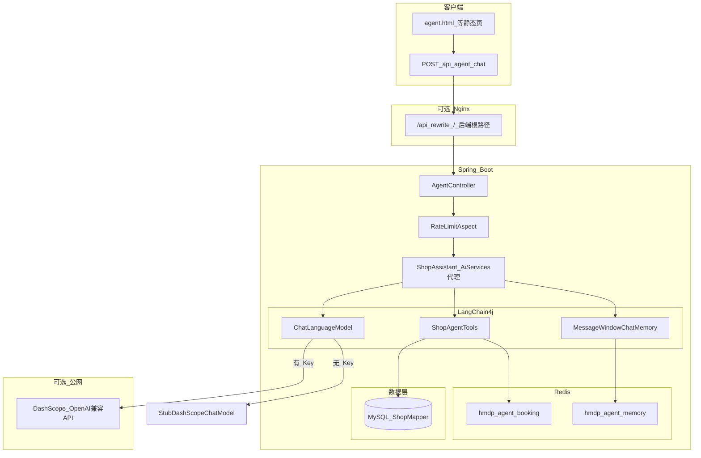

# Agent 架构说明

本文描述当前仓库内 **LangChain4j + 通义 DashScope（OpenAI 兼容）** 智能助手的实现架构，便于联调、面试讲解与后续扩展。

---

## 1. 总览

Agent 能力运行在 **Spring Boot 后端**（默认端口 `8088`），通过 **HTTP JSON** 对外暴露；静态 H5（Nginx 等）通过 **`/api` 反向代理** 调用同一接口。未配置大模型 API Key 时走 **本地 Stub**，不访问外网。

---

## 2. 核心组件

| 组件 | 路径 | 职责 |
|------|------|------|
| `AgentController` | `src/main/java/com/hmdp/controller/AgentController.java` | `POST /agent/chat` 入参校验、调用助手、返回 `Result`；声明 `@RateLimit` |
| `AgentConfiguration` | `src/main/java/com/hmdp/agent/config/AgentConfiguration.java` | 装配 `ChatLanguageModel`（OpenAI 兼容或 Stub）、构建 `AiServices` 型 `ShopAssistant` |
| `AgentDashScopeProperties` | `src/main/java/com/hmdp/agent/config/AgentDashScopeProperties.java` | `hmdp.agent.dashscope.*` 配置绑定 |
| `ShopAssistant` | `src/main/java/com/hmdp/agent/ShopAssistant.java` | LangChain4j 声明式接口：`@SystemMessage` / `@UserMessage` / `@MemoryId` |
| `ShopAgentTools` | `src/main/java/com/hmdp/agent/tools/ShopAgentTools.java` | `@Tool`：查店、搜店、演示预约写 Redis |
| `RedisChatMemoryStore` | `src/main/java/com/hmdp/agent/memory/RedisChatMemoryStore.java` | 实现 `ChatMemoryStore`，会话 JSON 存 Redis |
| `StubDashScopeChatModel` | `src/main/java/com/hmdp/agent/StubDashScopeChatModel.java` | 无 Key 时 `generate` 返回固定说明文案 |
| `AgentChatRequest` | `src/main/java/com/hmdp/dto/AgentChatRequest.java` | `sessionId`、`message` 请求体 |

**依赖（Maven）**：`dev.langchain4j:langchain4j`、`langchain4j-open-ai`（版本由 `langchain4j-bom` 管理，见 `pom.xml`）。

---

## 3. 请求链路（一次对话）

1. 客户端 `POST` **`/agent/chat`**（经 Nginx 时常为 **`/api/agent/chat`**），Body：`{ "sessionId", "message" }`。
2. **`RateLimitAspect`** 按注解 `agentChat` 维度做 **Redis 滑动窗口**（与业务 key 组合），超限直接 `Result.fail`。
3. **`AgentController`** 调用 **`shopAssistant.chat(sessionId, message)`**。
4. LangChain4j **`AiServices`** 实现：
   - 用 **`sessionId`** 从 **`RedisChatMemoryStore`** 取历史 **`ChatMessage`** 列表；
   - **`MessageWindowChatMemory`** 限制轮数（`max-messages`）；
   - 将用户新消息与历史交给 **`ChatLanguageModel`**；
   - 模型按需触发 **`ShopAgentTools`**（Function Calling），工具内访问 **MySQL** / **Redis**；
   - 将助手回复写回记忆存储（同一会话 key）。
5. 控制器将 **最终字符串回复** 封装为 **`Result.ok(data)`** 返回。

---

## 4. 模型与配置

| 配置项 | 说明 |
|--------|------|
| `hmdp.agent.dashscope.api-key` | 优先 **`LLM_API_KEY`**，其次 **`DASHSCOPE_API_KEY`**（与 `seckill-agent` 的 `.env` 命名一致） |
| `hmdp.agent.dashscope.base-url` | 优先 **`LLM_BASE_URL`**；未设置时为 DashScope **OpenAI 兼容**默认端点 |
| `hmdp.agent.dashscope.model-name` | 优先 **`LLM_MODEL`**；未设置时默认 `qwen-turbo` |
| `hmdp.agent.dashscope.memory-ttl-minutes` | Redis 会话 TTL |
| `hmdp.agent.dashscope.max-messages` | 窗口最大消息条数 |

**无 Key**：`AgentConfiguration` 注入 **`StubDashScopeChatModel`**，不发起 HTTP 到 DashScope。

---

## 5. Redis 与常量

定义见 `src/main/java/com/hmdp/utils/RedisConstants.java`：

| Key 前缀 | 用途 |
|----------|------|
| `hmdp:agent:memory:` + `sessionId` | 会话消息 JSON 数组（用户/助手文本） |
| `hmdp:agent:booking:` + `bookingId` | 演示预约单 JSON，短 TTL（约 7 天） |

---

## 6. 工具（Tools）与数据

| 方法 | 行为 |
|------|------|
| `getShopJsonById` | `ShopMapper.selectById` → JSON 或「未找到」 |
| `searchShopsByName` | `LambdaQueryWrapper` 模糊匹配，`LIMIT 10` |
| `bookVisit` | 校验店铺存在后写 **Redis 预约单**（演示，非真实履约） |

---

## 7. 安全与网关

- **登录**：`MvcConfig` 中 **`/agent/**` 已列入登录拦截排除**，便于演示；若需强制登录，应缩小 `excludePathPatterns` 并保证前端带 `authorization`。
- **限流**：`AgentController` 上 **`@RateLimit(windowSeconds = 60, maxRequests = 30, key = "agentChat")`**，与 `RateLimitAspect` + Lua 脚本一致。
- **Nginx**：`location /api` 中 `rewrite` 去前缀后 **`proxy_pass`** 到 Spring Boot；前端 `axios.defaults.baseURL = '/api'` 时请求路径写 **`/agent/chat`** 即可。

---

## 8. 前端入口（静态资源）

根目录：`nginx-1.18.0/html/hmdp/`（以你实际部署为准）

| 资源 | 说明 |
|------|------|
| `agent.html` | 会话 ID、输入框、调用 `POST /agent/chat`；`sessionId` 可存 **`sessionStorage.hmdp_agent_sid`** |
| `index.html` / `js/footer.js` | 底栏「助手」、首页顶栏等跳转 `agent.html` |
| `me.html`、`info-edit.html` | 个人相关页链到 `agent.html` |

---

## 9. 与「简历表述」的对应关系

- **LangChain4j**：`AiServices` + `ShopAssistant` + `ShopAgentTools`。
- **百炼 / 通义**：通过 **DashScope OpenAI 兼容 HTTP** + `OpenAiChatModel`，非独立「百炼 SDK」进程。
- **会话记忆**：**Redis** 持久化 `ChatMemoryStore`。
- **Function Calling**：`@Tool` 查库与演示预约。
- **ReAct**：未手写 ReAct 循环；由 **LangChain4j 与模型** 在多轮 + 工具调用下完成编排，讲解时建议表述为「工具调用型 Agent」。

更偏「简历与仓库口径」的说明见 [RESUME_ALIGNMENT.md](./RESUME_ALIGNMENT.md)。

---

## 10. 扩展建议（可选）

- 增加 **`GET /agent/health`** 或 Actuator，区分「Stub / 真实模型」与 Redis 连通性。
- 为 **`RedisChatMemoryStore`**、`AgentController` 补充集成测试（Testcontainers Redis 等）。
- 需要鉴权时：去掉 `/agent/**` 排除，并与 **`UserHolder`** 结合做按用户限流或审计日志。

---

## 11. 故障排查：`Tools are currently not supported by this model`

**含义**：当前在 `OpenAiChatModel` 上配置的 **模型端点不支持 LangChain4j 的 tools / function calling**（常见于 **OpenRouter** 上部分 `qwen/...` 或其它仅聊天 API）。

**处理方式（二选一）**：

1. **换用支持 tools 的模型**（DashScope 官方兼容接口上选带工具能力的模型，或 OpenRouter 文档中标明支持 *tools / function calling* 的模型）。
2. **关闭工具注册**（仍可多轮对话，但不会自动查库 / 写演示预约）：仓库默认 **`tools-enabled=false`**。若你曾显式打开，可设 **`hmdp.agent.dashscope.tools-enabled=false`** 或 **`HMDP_AGENT_DASHSCOPE_TOOLS_ENABLED=false`**，重启应用。

**需要查店等工具时**：换用支持 function calling 的模型与端点后，设 **`HMDP_AGENT_DASHSCOPE_TOOLS_ENABLED=true`**（或 `tools-enabled: true`）。

实现见 `AgentConfiguration`：仅在 `tools-enabled=true` 时执行 `.tools(shopAgentTools)`。
