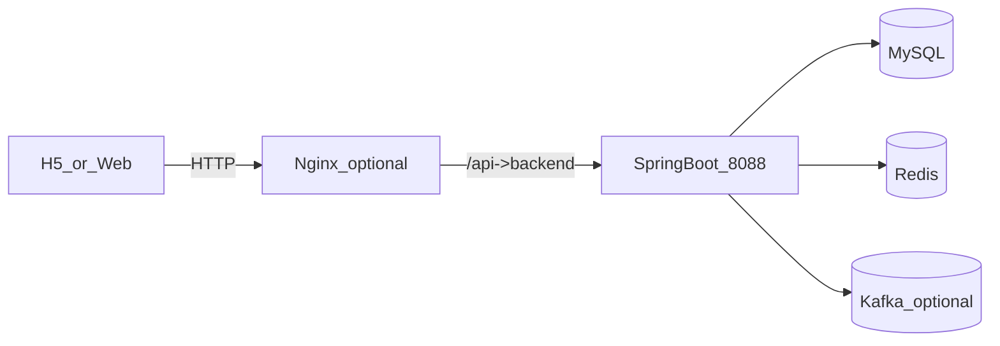

# hm-dianping 项目介绍（面试详细版）

> 适用场景：面试中做 5-15 分钟项目介绍、回答深挖问题、准备简历背后的技术细节。  
> 版本口径：以当前仓库代码为准（Spring Boot 单体 + Redis + MySQL + Kafka 可选 + Agent）。

---

## 1. 项目一句话介绍

`hm-dianping` 是一个本地生活类平台后端项目，核心覆盖用户登录、店铺查询、探店笔记、关注 feed、优惠券与秒杀下单，并在此基础上加入了智能助手能力（LangChain4j + DashScope OpenAI 兼容模式）和生产化增强（多级缓存、消息异步、可观测性指标）。

---

## 2. 业务功能全景

### 2.1 用户与登录

- 手机验证码登录（验证码写 Redis，token 写 Redis）。
- 登录态通过拦截器链维护：刷新 token TTL、ThreadLocal 挂载用户。
- 支持当前用户信息与用户简要信息查询。

### 2.2 店铺与检索

- 店铺详情查询、更新、新增。
- 按类型分页、按名称搜索。
- 基于 Redis GEO 的附近店铺查询与距离排序。

### 2.3 社交与内容

- 探店笔记发布、点赞、热门列表。
- 关注/取关、共同关注。
- 粉丝收件箱 + 滚动分页读取（Feed 流模式）。

### 2.4 优惠券与秒杀

- 普通券、秒杀券管理。
- 秒杀库存预热 Redis。
- 秒杀链路：Lua 原子校验 + Redis Stream 异步消费 + DB 落单。

### 2.5 智能助手（Agent）

- `POST /agent/chat` 对话接口，支持会话记忆。
- 可配置启用/禁用工具调用（Function Calling）。
- 工具能力含店铺查询、模糊搜索、演示预约登记。

---

## 3. 技术架构与分层

## 3.1 总体架构

### 3.2 代码分层

- `controller`：接收请求与参数校验。
- `service/impl`：核心业务规则（缓存、并发、事务、异步）。
- `mapper`：MyBatis-Plus 数据访问。
- `utils`：缓存工具、锁、拦截器、ID 生成等。
- `config`：拦截器、Redisson、调度器、异常处理。

---

## 4. 核心技术方案（重点回答区）

## 4.1 缓存设计（店铺详情）

### 多层缓存结构

- L1：Caffeine 本地缓存（`ShopLocalCache`）。
- L2：Redis（逻辑过期数据模型 `RedisData`）。
- 前置防穿透：Redisson Bloom Filter（`ShopBloomService`）。

### 解决的问题

- **缓存穿透**：空值标记 + Bloom 预判。
- **缓存击穿**：逻辑过期 + 互斥锁 + 后台重建线程池。
- **热点击穿并发压力**：冷加载退避重试（指数 backoff）。

### 你可以这样讲

1. 查询先看 Bloom 和 L1，最大化减轻 Redis。
2. L2 命中但逻辑过期时，先返回旧值保证可用性，再异步重建。
3. 只允许拿到锁的线程重建，避免同时打 DB。
4. 物理 TTL 设为“逻辑 TTL + skew”，避免 key 过早被 Redis 清除。

---

## 4.2 缓存一致性（多实例）

- 更新店铺时本机立即删本地缓存 + Redis。
- 可选开启 Kafka 广播失效（`hmdp.kafka.cache-invalidation.enabled=true`）：
  - 发布失效消息。
  - 所有实例消费后各自清理本地缓存。
  - 延迟双删 Redis，降低并发下短暂脏读概率。

---

## 4.3 秒杀链路（高并发）

### 为什么这么做

秒杀本质是“高并发写”，不能让大量请求直接同步打数据库。

### 实现步骤

1. 请求到达后执行 Lua：
   - 校验库存
   - 校验一人一单
   - 扣减库存
   - 写入 Stream 消息
2. 应用内消费者异步消费 Stream，执行事务下单。
3. 用户粒度加分布式锁兜底，防重复下单。
4. pending-list 补偿，避免消息丢失。

### 当前增强

- 消费者并发数可配置。
- 批量读取可配置。
- pending 错误阈值告警。
- 增加消费、异常、补偿等指标埋点。

---

## 4.4 鉴权与会话

- `RefreshTokenInterceptor`：每次请求从 Redis 拉取用户，刷新 TTL。
- `LoginInterceptor`：保护业务接口，未登录返回 401。
- `UserHolder`：ThreadLocal 传递用户上下文。

---

## 4.5 Agent（智能助手）能力

### 运行方式

- Agent 在同一个 Spring Boot 进程内实现（非独立 Java 子服务）。
- 通过 LangChain4j `AiServices` 构建 `ShopAssistant`。

### 模型与回退

- 模型调用使用 DashScope OpenAI 兼容接口。
- 若未配置 API Key，会使用 `StubDashScopeChatModel`，不访问外网。

### 工具调用策略

- `tools-enabled=false`：纯对话模式，适配不支持 function calling 的模型。
- `tools-enabled=true`：允许模型调用 `ShopAgentTools` 查店与演示预约。

### 会话记忆

- 记忆存 Redis，按 `sessionId` 隔离。
- 有 TTL 和最大消息窗口，避免无限膨胀。

---

## 5. 可观测性建设（本项目亮点）

项目已暴露 Actuator 与 Prometheus 指标，且新增了业务指标：

- 缓存链路：
  - `hmdp.cache.logical.hit/miss/rebuild/cold_retry`
  - `hmdp.cache.shop.local.hit/miss`
- Kafka 失效广播：
  - `hmdp.kafka.cache_invalidation.publish/consume/...`
- 秒杀 Stream：
  - `hmdp.stream.orders.processed/consume_error/pending_retry/pending_error`

这让项目从“能跑”升级为“可观测、可调优、可运维”。

---

## 6. 我的实现重点（可直接口述）

你可以按这个顺序讲你做的事情：

1. **完善缓存体系**：L1+L2+Bloom，解决穿透/击穿问题。  
2. **补齐一致性**：店铺更新后支持 Kafka 跨节点失效广播。  
3. **优化秒杀消费**：消费者并发可配置，pending 补偿与告警完善。  
4. **增强可观测性**：业务指标接入 Actuator/Prometheus。  
5. **清理历史实现**：统一缓存入口，去除重复逻辑，降低维护成本。  
6. **配置安全化**：数据库和 Redis 密码改为环境变量注入。  

---

## 7. 典型难点与取舍（面试深挖）

### 7.1 逻辑过期 vs 强一致

- 逻辑过期优先可用性，允许短暂旧数据。
- 对读多写少场景收益高；若业务强一致要求更高，可叠加版本号校验。

### 7.2 Redis Stream 语义

- 至少一次消费语义（ACK 在业务成功后）。
- 要配合业务幂等（唯一索引/重复检查）才能保证最终正确。

### 7.3 Kafka 只做什么，不做什么

- 本项目 Kafka 用于缓存失效广播，不承载秒杀订单主链路。
- 秒杀主链路采用 Redis Stream。

---

## 8. 面试可讲的性能与稳定性收益（定性）

- 热点查询显著减少 DB 压力（多层缓存 + 异步重建）。
- 秒杀高峰写流量从“同步落库”改为“异步削峰”，稳定性更好。
- 增加指标后可快速定位问题（是缓存命中下降、消费堆积还是 Kafka 广播异常）。

> 说明：若面试要求具体数字（QPS、P99、命中率），建议基于压测报告给出，不建议口头虚报。

---

## 9. 项目启动与联调（简版）

1. 启 MySQL、Redis。  
2. 按 `application.yaml` 配置环境变量。  
3. `mvn spring-boot:run` 启后端。  
4. 可选启动 Kafka 并开启 `HMDP_KAFKA_CACHE_INVALIDATION_ENABLED=true`。  
5. 访问 `actuator/health` 与业务接口验证。  

---

## 10. 面试时的“30 秒版本”

“这是一个本地生活平台后端，我负责高并发和稳定性这块。核心上，我做了店铺多级缓存和 Bloom 防穿透，结合逻辑过期 + 互斥重建解决热点击穿；秒杀链路用 Lua + Redis Stream 做原子校验和异步削峰，并补了 pending 补偿。多实例场景下，我加了 Kafka 缓存失效广播和延迟双删。最后接入了 Actuator/Prometheus 业务指标，能够直接看到缓存命中、Stream 消费、Kafka 广播健康度，项目从功能可用提升到可观测可运维。”  

